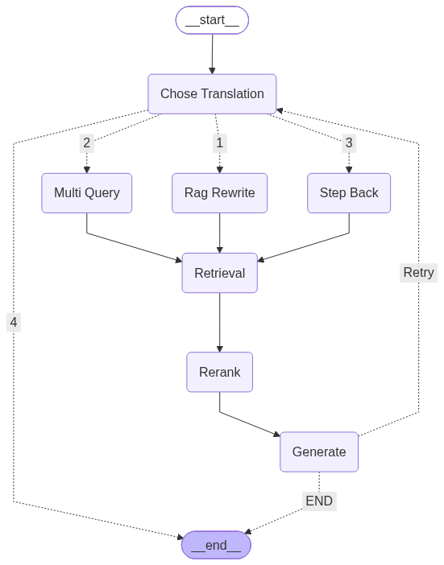

# Adaptive RAG Pipeline 
A retrieval system that dynamically routes queries to optimize answer quality and reduce hallucinations.

Most simple RAG systems fail due to a lack of trying different methods. Which is exactly what this adaptive RAG Pipeline does differently. It attempts multiple different query translation methods to find the best way transforming to query to improve retrieval. 


This Adpative RAG System is quite greedy. Using an LLM's own logic, it will chose the best query transformation for the given user's query. However, if that method fails to be provide the correct context to answer this query, it will try another method. 

How it works: 
1. Pick the best query translation method given a query
2. retreive documents, rank them in order of revelance and then provide them to a llm
3. If the llm deicdes that these documents aren't good enough to answer the query, it will go back to the start and chose another translation.
4. Only once the llm decides that it has enough context to generate a good answer, or has tried all 3 provided query translation methods will it end. 

Evaluation Scores
| Success Rate | Average Faithfulness Score | Average Answer Relevancy Score |
| -------- | -------- | -------- |
| 98.96%   | 0.9898   | 0.9864   |

Evalutions for this RAG system were done using DeepEval, which produced the results above. These results are produced by evulating 49 domain-specific questions. 

# Packages Used
* LangGraph
* DeepEval
* HuggingFace
* LangGraph.openai

# How to Run Locally
```bash
git clone "https://github.com/VakeesanM/RAG-System-with-Evaluation.git"
pip install -r requirement.txt
streamlit run "RAGSystem\app.py"
```
